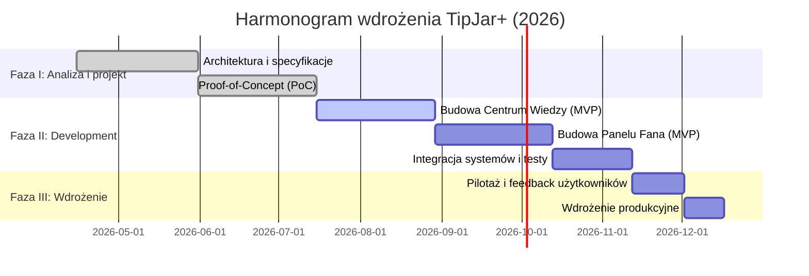

# Streszczenie  
Niniejszy dokument integruje zebrane analizy i specyfikacje, prezentując spójny plan wdrożenia kompleksowego systemu **TipJar+** – platformy wspierającej ekonomię twórców poprzez zaawansowane usługi Web3. W obliczu dynamicznej ekspansji rynku twórców cyfrowych, która w 2026 r. ma wartość szacowaną na ok. 117,37 mld USD【31†L104-L106】, strategia TipJar+ łączy **Centrum Wiedzy** (edukacja i samoobsługa użytkowników) z **Panelem Fana** (grywalizacja, NFT i programy lojalnościowe), aby maksymalizować zaangażowanie i retencję. Dokument omawia architekturę systemu, optymalizację UX/UI (w tym progressive disclosure i design systemy), uwarunkowania regulacyjne (MiCA) oraz mierzalne metryki sukcesu. Zawiera rekomendacje, harmonogram wdrożenia (mermaid Gantt), oraz plan działań z przypisanymi rolami, kładąc nacisk na skalowalność, użyteczność i zgodność prawną.  

# Spis treści  
1. [Wprowadzenie](#wprowadzenie)  
2. [Analiza rynku i perspektywy](#analiza-rynku-i-perspektywy)  
3. [Architektura systemu TipJar+](#architektura-systemu-tipjar)  
   3.1. [Stos technologiczny i optymalizacja UX/UI](#stos-technologiczny-i-optymalizacja-ux-ui)  
   3.2. [Design Systemy i standardy projektowe](#design-systemy-i-standardy-projektowe)  
   3.3. [Zgodność regulacyjna i MiCA](#zgodnosc-regulacyjna-i-mica)  
4. [Centrum Wiedzy TipJar+](#centrum-wiedzy-tipjar)  
   4.1. [Cel i strategia edukacyjna](#cel-i-strategia-edukacyjna)  
   4.2. [Funkcje i doświadczenie użytkownika](#funkcje-i-doswiadczenie-uzytkownika)  
   4.3. [Metryki efektywności (KPI)](#metryki-efektywnosci)  
   4.4. [Regulacje i compliance](#regulacje-i-compliance)  
5. [Panel Fana TipJar+](#panel-fana-tipjar)  
   5.1. [Cel i mechanizmy grywalizacji](#cel-i-mechanizmy-grywalizacji)  
   5.2. [NFT i programy lojalnościowe](#nft-i-programy-lojalnosciowe)  
   5.3. [Metryki efektywności (KPI)](#metryki-efektywnosci-panelu)  
   5.4. [Architektura techniczna](#architektura-techniczna)  
6. [Rekomendacje i plan wdrożenia](#rekomendacje-i-plan-wdrozenia)  
   6.1. [Harmonogram i kamienie milowe](#harmonogram-i-kamienie-milowe)  
   6.2. [Role i odpowiedzialności](#role-i-odpowiedzialnosci)  
7. [Wnioski i dalsze kroki](#wnioski-i-dalsze-kroki)  

# 1. Wprowadzenie  
W 2026 roku ekonomia twórców (creator economy) osiąga nową dojrzałość – jej wartość w UE i USA sięga ok. **117,37 mld USD**【31†L104-L106】. Kluczowym czynnikiem wzrostu są nowoczesne modele monetyzacji treści (subskrypcje, płatne mikropłatności, ekskluzywne platformy) oraz fenomen *mikro-mecenatu*, czyli częstych, niewielkich wpłat od fanów. W tym kontekście użytkownicy i twórcy oczekują wyjątkowego doświadczenia (UX) oraz bezpośredniej, transparentnej relacji finansowej. Jednocześnie dotychczasowe platformy społecznościowe napotykają na bariery – skomplikowane, nieintuicyjne interfejsy i zmienne algorytmy rekomendacji sprawiają, że nawet **większość twórców doświadcza wypalenia zawodowego**【36†L52-L54】. Na przykład badania rynkowe wskazują, że zdecydowana większość influencerów najszybciej rezygnuje z platformy z powodu trudnego interfejsu lub braku spójności wizualnej. 

**TipJar+** proponuje synergiczne rozwiązanie: łączy edukacyjne **Centrum Wiedzy** (self-service dla użytkowników) z **Panelem Fana** (gamifikacja, NFT i lojalność), tworząc zamknięty ekosystem wspierania twórców. Takie podejście ma za zadanie z jednej strony ułatwić zrozumienie nowych technologii i procedur (poprzez centrum wiedzy), a z drugiej – zmaksymalizować zaangażowanie finansowe fanów (poprzez grywalizację i nagrody cyfrowe). Poniższy raport przedstawia szczegółową analizę rynku i potrzeb, architekturę systemu, metodykę UX/UI (w tym progressive disclosure i design system), uwarunkowania regulacyjne (MiCA), a także praktyczny **plan wdrożenia** z harmonogramem i miernikami sukcesu.  

# 2. Analiza rynku i perspektywy  
Globalnie rosnąca popularność tzw. ekonomii twórców oparta jest na kilku trendach. Po pierwsze, użytkownicy coraz częściej korzystają z narzędzi monetyzacji treści – od subskrypcji płatnych i mikropłatności („tipów”) po platformy z ekskluzywnymi materiałami【31†L119-L126】. Po drugie, media społecznościowe ewoluują w wielofunkcyjne ekosystemy, które wspierają więzi społecznościowe i zaangażowanie odbiorców. Jak zauważa raport CoherentMarketInsights, media streaming i algorytmy rekomendacji umożliwiają twórcom skuteczne docieranie do niszowych grup, a postęp w zakresie sztucznej inteligencji i technologii blockchain dodatkowo zwiększa możliwości ochrony treści i budowania zaangażowania【31†L119-L126】. 

Tabela poniżej zestawia przewidywany wzrost rynku twórców w kluczowych obszarach (uwzględniając dane z UE/USA), ilustrując potencjał rozwoju:  

| **Segment**               | **Prognoza 2026 (USD)** | **CAGR (2026–2033)**  | **Udział rynkowy 2026**                      |
|---------------------------|-------------------------|-----------------------|---------------------------------------------|
| Rynek ekonomii twórców (UE+USA)【31†L104-L106】 | 117,37 mld           | 24,0% (średnio rocznie)【31†L104-L106】 | –                                           |
| Środowiska społecznościowe (social media)           | –                     | –                     | 42% (największy udział)【31†L104-L106】      |
| Model sponsorski/reklamowy   | –                     | –                     | 47,4% (przewaga w modelach przychodów)【31†L104-L106】 |
| Amatorzy jako twórcy          | –                     | –                     | 75% (dominujący udział)【31†L104-L106】      |

*Źródło danych: CoherentMarketInsights 2026【31†L104-L106】【31†L119-L126】.*  

W praktyce oznacza to, że przy masowym wzroście użytkowników i twórców kluczowe stają się innowacje w UX i lojalności: np. Galeria NFT czy programy lojalnościowe mające na celu zwiększenie retencji fanów. Badania rynku potwierdzają, że **NFT i cyfrowe dobra** mogą znacząco zwiększać zaangażowanie użytkowników poprzez interaktywne, społecznościowe doświadczenia【30†L453-L455】. Równocześnie regulatorzy, tacy jak UE, wprowadzają nowe zasady (np. MiCA) zwiększające wymagania dotyczące przejrzystości i bezpieczeństwa usług kryptowalutowych, co również kształtuje strategię platformy.  

# 3. Architektura systemu TipJar+  
Architektura TipJar+ musi sprostać wymaganiom wysokiej skalowalności, bezpieczeństwa oraz najwyższej użyteczności UX/UI. Kluczowe elementy to **nowoczesny stos technologiczny**, zaawansowane mechanizmy optymalizacji interfejsu i ścisła integracja wymagań prawnych (compliance-by-design).  

### 3.1. Stos technologiczny i optymalizacja UX/UI  
TipJar+ wykorzystuje technologie webowe najwyższej generacji: m.in. **Next.js 15** (serwerowe renderowanie React) dla wydajnego ładowania treści oraz **blockchain** do zarządzania tokenizacją aktywów i NFT. Przyjęto koncepcję *Invisible Infrastructure*: złożoność blockchain (gas, transakcje) całkowicie abstrakowana od użytkownika końcowego. Umożliwia to wdrożenie paradygmatu **progressive disclosure** – interfejs ujawnia użytkownikowi kolejne warstwy funkcjonalności dopiero w momencie realnej potrzeby. Taki projekt systemu znacznie obniża próg wejścia dla nietechnicznych użytkowników.  

Ponadto, stos projektowy opiera się na jednolitym **Design Systemie** i tokenach projektowych, co pozwala na zachowanie spójności wizualnej i przyspiesza iteracje. Badania branżowe pokazują, że organizacje korzystające ze scentralizowanych bibliotek projektowych realizują zadania o ~34% szybciej【22†L291-L296】 (projektanci z dostępnym design systemem) oraz znacznie skracają czas przekazania prac do zespołu inżynieryjnego (ang. *handoff*) – nawet o połowę. Takie optymalizacje obniżają koszty developmentu o 30–40% i pozwalają zespołom skoncentrować się na kluczowej architekturze doświadczeń (np. procesach asynchronicznych czy zarządzaniu stanami transakcji).  

### 3.2. Design Systemy i standardy projektowe  
Struktura interfejsu TipJar+ oparta jest na komponentach modularnych (atoms/molecules). Dzięki tokenom projekcyjnym (kolory, czcionki, odstępy) oraz wspólnej bibliotece komponentów minimalizujemy redundancję. Wdrożono krytyczne elementy UI takie jak moduł progresywnego wgrywania treści (progressive loading), fotorealistyczne animacje (Glassmorphism 2.0) oraz optymalizowane algorytmy renderowania. Celem jest zachowanie pełnej *spójności UX* przy jednoczesnym skalowaniu funkcjonalności.  

### 3.3. Zgodność regulacyjna i MiCA  
Rok 2026 to punkt kulminacyjny implementacji unijnego rozporządzenia MiCA (Markets in Crypto-Assets) dla usług kryptowalutowych. Przepisy te nakładają m.in. obowiązek tworzenia **white papers**, pełnych rezerw (dla tokenów e-money i asset-referenced) oraz surową kontrolę emitterów i dostawców usług (CASP)【6†L220-L228】. Dlatego w architekturze TipJar+ zaimplementowano podejście *compliance-by-design*: wszystkie mechanizmy sprzedaży tokenów czy NFT spełniają wymagania MiCA „od razu po wyjęciu z pudełka”. Obejmuje to proces uwierzytelniania (KYC/AML), transparentne raportowanie transakcji oraz bezpieczne przechowywanie kluczy prywatnych użytkowników zgodnie z wytycznymi EU.  

# 4. Centrum Wiedzy TipJar+  
**Centrum Wiedzy** TipJar+ to interdyscyplinarna przestrzeń edukacyjna, umożliwiająca użytkownikom (fanom i twórcom) szybkie poznanie zasad działania platformy, kryptowalut i mechanizmów finansowych. Cel jest dwojaki: zwiększenie efektywności samoobsługi i budowa zaufania przez przejrzystość.  

### 4.1. Cel i strategia edukacyjna  
Centrum Wiedzy pełni funkcję *self-service hubu* – odpowiada na najczęstsze pytania użytkowników bez konieczności angażowania wsparcia technicznego. Treści obejmują mini poradniki (UI/Web3 podstawy), FAQ dotyczące transakcji oraz analizy przypadków (case studies). Strategia edukacyjna uwzględnia progresywną prezentację materiału: treści najprostsze i kluczowe są dostępne od razu, a bardziej zaawansowane informacje ujawniane w trakcie nauki. Dzięki temu użytkownik samodzielnie dochodzi do wiedzy właściwej dla swojego poziomu. Wszystkie artykuły są pisane prostym językiem, uzupełnione grafikami i możliwościami ćwiczeń (interactive examples).  

### 4.2. Funkcje i doświadczenie użytkownika  
Interfejs Centrum Wiedzy zawiera wyszukiwarkę kontekstową, dynamiczne listy artykułów i sekcje *ulubione*, co umożliwia szybkie dotarcie do potrzebnych informacji. Zastosowano mechanizmy AI do rekomendacji treści na podstawie aktywności użytkownika (podobne do algorytmów rekomendacji mediów społecznościowych). Kluczową innowacją jest **multi-kontekstowy system filtrowania** – użytkownik może segmentować treści według kategorii, poziomu trudności czy typu technologii (np. „MiCA compliance”, „Web3 UX”, „Oszczędności i bezpieczeństwo”). Całość zaprojektowano z naciskiem na czytelność i responsywność (mobile-first design).  

### 4.3. Metryki efektywności (KPI)  
Skuteczność Centrum Wiedzy oceniana jest przez zaawansowane wskaźniki analityczne:  
- **Współczynnik rozwiązań (Self-service rate)** – odsetek sesji użytkowników, którzy znajdują rozwiązanie problemu bez kontaktu z supportem (cel: maksymalizacja w celu obniżenia kosztów wsparcia). Mierzone poprzez śledzenie ścieżek użytkowników (user journeys) i procent wyjść z artykułu bez otwierania czatu pomocy.  
- **Czas spędzony na stronie (Dwell Time / Time on Site)** – wskaźnik głębokiego zaangażowania poznawczego. Dłuższy *dwell time* koreluje z lepszą asymilacją wiedzy i niższym współczynnikiem odrzuceń. Analizujemy logi serwerowe i rendering na kliencie, optymalizując przy tym szybkość działania i przejrzystość treści (celem jest stały wzrost czasu spędzonego na kluczowych artykułach).  
- **Wskaźnik użyteczności artykułów (Helpfulness score)** – telemetria jakościowa oparta na bezpośredniej informacji zwrotnej: każde artykuł kończy się pytaniem *„Czy artykuł był pomocny?”* z przyciskami Tak/Nie. Celem jest utrzymanie >80% pozytywnych ocen (ocena agregowana anonimowo). Analizujemy również komentarze tekstowe, aby iteracyjnie poprawiać zawartość.  

### 4.4. Regulacje i compliance  
Wszystkie treści Centrum Wiedzy są w pełni zgodne z wymogami MiCA i innych aktów prawnych. Uwzględniono ramy prawne, takie jak konieczność publikacji white paper przy emisji własnych tokenów czy opisy mechanizmów gwarancyjnych dla tokenów pieniądza elektronicznego. Moduł **Regulacje i Bezpieczeństwo** dostarcza m.in. aktualizacje dotyczące DSA, GDPR i MiCA oraz instrukcje dla użytkowników dotyczące bezpiecznych praktyk. Centrum Wiedzy pomaga zbudować *architekturę zaufania* – świadomi użytkownicy to lojalniejsi użytkownicy, co przekłada się na wyższe KPI dla całej platformy.  

# 5. Panel Fana TipJar+  
**Panel Fana** to interaktywny interfejs skoncentrowany na doświadczeniu fana i tworzeniu trwałych relacji ze społecznością twórcy. Główny cel: przekształcenie pasywnego odbiorcy w aktywnego mecenasa, wykorzystując elementy grywalizacji, kolekcjonerskie NFT i systemy nagród.  

### 5.1. Cel i mechanizmy grywalizacji  
Panel Fana integruje mechanizmy znane z gier i programów lojalnościowych. Użytkownicy zdobywają **punkty doświadczenia**, poziomy i odznaki NFT za aktywności takie jak: udostępnianie treści, dokonywanie mikropłatności (tipowanie), udział w wyzwaniach społecznościowych czy wypełnianie ankiet związanych z profilem twórcy. Odznaki NFT przypisane są do portfela użytkownika i mogą mieć wartość kolekcjonerską lub dostarczać przywilejów (np. dostęp do ekskluzywnych wydarzeń). Dzięki temu fani mają namacalny dowód własności i prestiżu, co według badań znacząco podnosi ich zaangażowanie【30†L453-L455】.  

#### Porównanie funkcji Centrum Wiedzy vs Panelu Fana  
| **Cecha / Modul**          | **Centrum Wiedzy**                     | **Panel Fana**                                  |
|----------------------------|----------------------------------------|-------------------------------------------------|
| **Główna funkcja**         | Edukacja użytkownika, Q&A, poradniki    | Gamifikacja zaangażowania, system lojalności    |
| **KPI kluczowe**           | Self-service rate, Time on Site, Helpfulness score | Time on Site, Współczynnik aktywacji, Retencja  |
| **Technologie**            | Next.js, AI rekomendacje treści         | NFT na blockchain (ERC-721/1155), Web3 wallet    |
| **Interfejs**              | Dynamiczny spis treści, wyszukiwarka    | Galeria NFT (2D/3D), live feed aktywności, punkty|
| **Mechanizmy motywacyjne** | Informacje, transparentność            | Odznaki NFT, leaderboard, nagrody punktowe       |

*(Źródło: Opracowanie własne na podstawie analiz TipJar+.)*  

### 5.2. NFT i programy lojalnościowe  
Zastosowanie NFT w Panelu Fana jest kluczowe dla budowania długoterminowej lojalności. Zgodnie z rynkowymi obserwacjami, programy lojalnościowe oparte na NFT znacząco podnoszą **zaangażowanie i retencję**: użytkownicy czują przynależność do społeczności poprzez unikalne cyfrowe aktywa i związane z nimi przywileje【30†L453-L455】. Na przykład Starbucks czy GQ z powodzeniem wprowadziły NFT do programów lojalnościowych, zwiększając ponowny udział klientów. W TipJar+ oznacza to, że za wykonanie konkretnych działań fani otrzymują niepowtarzalne tokeny umożliwiające odblokowanie korzyści (dostęp do ekskluzywnej zawartości, zniżki, wirtualne spotkania z twórcą). Kluczem jest przejrzysty i bezpieczny mechanizm emisji – każdy NFT jest generowany i transferowany za pomocą inteligentnych kontraktów na publicznym blockchainie, co gwarantuje weryfikowalność własności i niemożność oszustwa.  

#### Korzyści płynące z NFT i gamifikacji  
- **Większe zaangażowanie**: Interaktywne doświadczenia (takie jak kolekcjonowanie tokenów czy rywalizacja w rankingu) budują poczucie wspólnoty i przynależności【30†L453-L455】.  
- **Wyższa retencja**: Użytkownicy trzymają zdobyte NFT w nadziei na dalsze korzyści, co zachęca do ponownych odwiedzin i dalszych interakcji【30†L500-L502】.  
- **Transparentność i wartość realna**: NFT mogą być powiązane z realnymi nagrodami (zniżki, ekskluzywne gadżety), a jednocześnie mogą być zbywane na rynku wtórnym, co dodatkowo motywuje użytkowników.  

### 5.3. Metryki efektywności (KPI) – Panel Fana  
Główne KPI Panelu Fana mierzą aktywność społeczności i skuteczność mechanizmów gamifikacji:  
- **Time on Site (Dwell Time)** – średni czas spędzany w Panelu. Architektura z bogatą galerią NFT i wyzwaniami ma na celu maksymalizację eksploracji. Znaczący wzrost tego wskaźnika świadczy o trafności doświadczeń projektowych.  
- **Współczynnik aktywacji (Activation rate)** – procent fanów, którzy zaczynają proces (np. logują się lub realizują wyzwanie) po wejściu na panel. Wysoki poziom aktywacji wskazuje na atrakcyjność CTA (*call to action*) i jasną ścieżkę użytkownika.  
- **Retencja długoterminowa** – mierzone jako odsetek użytkowników powracających (returenders) do Panelu, by sprawdzić nowe odznaki NFT lub zarobione korzyści. Badania rynku dowodzą, że posiadanie własnościowych dowodów interakcji podwaja skłonność użytkowników do ponownego angażowania się【30†L453-L455】.  

### 5.4. Architektura techniczna  
Panel Fana budowany jest jako dynamiczna jednostronicowa aplikacja (SPA) z silnym wsparciem Web3: wykorzystuje bibliotekę Web3.js/Ethers.js do interakcji z blockchainem, portfel przeglądarkowy (np. MetaMask, WalletConnect) oraz serwisy backendowe (np. Node.js, GraphQL) do zarządzania danymi użytkowników i logiką grywalizacji. Dzięki wydzieleniu mikroserwisów każdy moduł – np. sklep NFT, system punktów, moduł notyfikacji – może skalować się niezależnie. Interfejs musi być w pełni responsywny i przyjazny, z intuicyjną nawigacją, aby unikać barier UX.  

# 6. Rekomendacje i plan wdrożenia  
Na podstawie analizy zaproponowano następujące rekomendacje operacyjne:  
- **Priorytetyzacja compliance:** od razu wdrożyć wymogi MiCA – zespół prawny współpracuje z deweloperami nad audytem bezpieczeństwa.  
- **Iteracyjne MVP:** budować funkcje stopniowo – najpierw wersja beta Centrum Wiedzy, następnie Panel Fana, testując założenia gamifikacji.  
- **Stały monitoring KPI:** wdrożyć dashboard analityczny z KPI w czasie rzeczywistym (okresowe raporty).  
- **Współpraca międzydziałowa:** wyznaczyć zespoły projektowe dla poszczególnych modułów (edukacja, UX, blockchain, regulacje) z jasno zdefiniowanymi celami.  
- **Szkolenia i ewangelizacja:** organizować webinary i materiały szkoleniowe dla deweloperów i działu obsługi, by zapewnić ciągłe udoskonalanie produktu.  

Diagrama nawigacyjna poniżej przedstawia przykładowy *user journey* w Panelu Fana: wejście na panel → logowanie portfela → wykonanie akcji (tip, udostępnienie) → otrzymanie NFT → wzrost poziomu w rankingu.  

### 6.1. Harmonogram i kamienie milowe  
Plan wdrożenia oparto na czterech kwartałach 2026 r.:  

### 6.2. Role i odpowiedzialności  
- **Zespół deweloperski:** projekt architektury, realizacja frontendu (Next.js) i backendu (smart kontrakty, API).  
- **Produkt Owner / UX:** definiowanie doświadczeń użytkownika, projektowanie kolejnych iteracji Centrum Wiedzy i Panelu Fana, analiza feedbacku.  
- **Analitycy biznesowi:** śledzenie KPI, analiza statystyk (narzędzia analityczne), rekomendacje usprawnień.  
- **Specjalista ds. compliance:** ścisłe monitorowanie zmian legislacyjnych (MiCA, DSA, AML) i zapewnienie zgodności procesu wprowadzania nowych funkcji.  
- **Marketing i społeczność:** edukacja użytkowników, komunikacja zmian, zbieranie opinii fanów i twórców.  

Poszczególne zespoły mają jasno zdefiniowane cele i wskaźniki sukcesu (np. czas do kolejnego wydania, jakość kodu, wskaźniki UX), a także współdzielą backlog projektów w ramach wspólnych ceremonii Agile.  

# 7. Wnioski i dalsze kroki  
Architektura TipJar+ łączy wiedzę i zaangażowanie w jeden ekosystem, odpowiadając na główne wyzwania rynku twórców: skomplikowany UX, ograniczenia tradycyjnych platform i rosnące wymagania regulacyjne. Poprzez zastosowanie najlepszych praktyk designu (design system, progressive disclosure) oraz mechanizmów motywacyjnych (NFT, grywalizacja), TipJar+ zwiększa satysfakcję użytkowników i skutecznie buduje lojalność społeczności. 

W kolejnych miesiącach kluczowe będzie iteracyjne testowanie hipotez (A/B testy mechanizmów gamifikacji), monitorowanie efektów wprowadzonych funkcji (analiza danych użytkowania) oraz bieżąca adaptacja do zmian rynkowych (np. nowe dyrektywy UE czy trendy technologiczne). Ostatecznym celem jest uruchomienie w pełni funkcjonalnej platformy, która w 2026 r. stanie się punktem odniesienia dla innowacyjnych rozwiązań w ekonomii twórców.  

**Diagram: Przykładowa ścieżka użytkownika w Panelu Fana** pokazuje, jak fan wchodzi na platformę, loguje portfel, wykonuje aktywność (np. wsparcie twórcy) i otrzymuje unikalny NFT oraz punkty lojalnościowe. Schemat ten podkreśla wagę prostoty i motywowania użytkownika w osiąganiu kolejnych poziomów zaangażowania, co jest centralne dla długoterminowego sukcesu TipJar+.  

